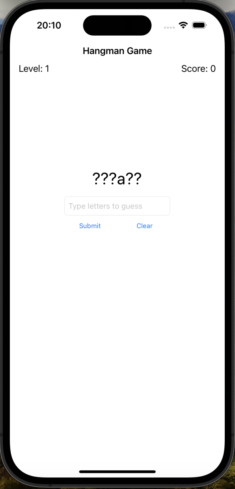
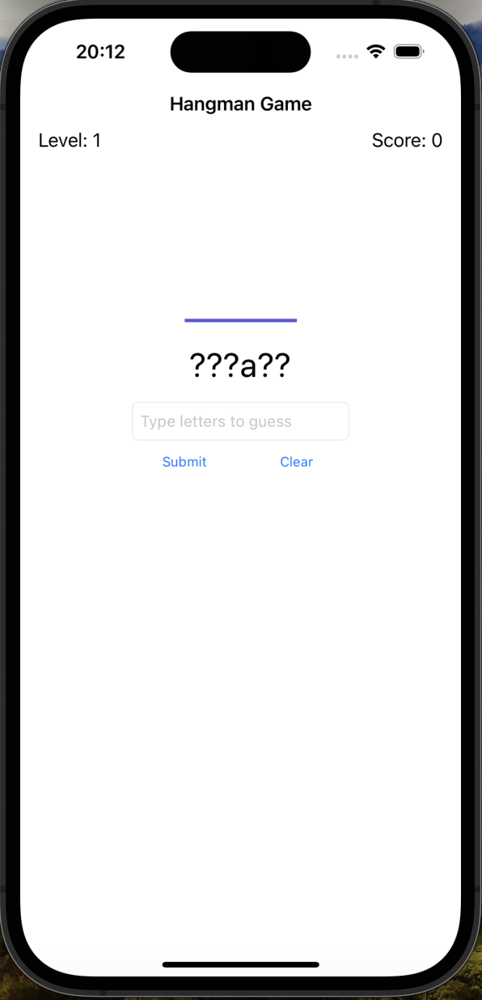
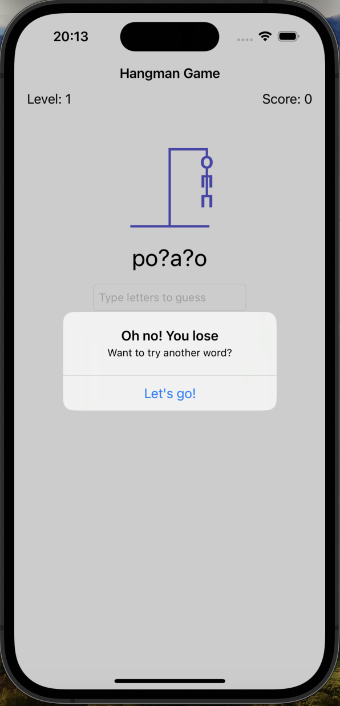

# HangmanGame

HangmanGame is a classic word-guessing game where players try to guess the letters of a hidden word. Each incorrect guess reveals a part of the hangman figure, and the game is lost if the full figure is displayed.

## Features

- Randomly selected words from a predefined list.
- Visual representation of the hangman with step-by-step drawing as incorrect guesses are made.
- Tracks score and level progression.
- User-friendly interface with text input for letter guesses.

## Usage

1. Launch the application.
2. The game starts with a hidden word displayed as a series of question marks (e.g., `??????`).
3. Enter a letter in the text field and tap "Submit" to guess a letter.
4. Correct guesses reveal the letter in the hidden word.
5. Incorrect guesses draw a part of the hangman.
6. Win the game by guessing the word before the hangman is fully drawn.
7. Advance to the next level upon winning, or start a new game upon losing.

## Screenshots

### Main Screen

### Correct Guess

### Incorrect Guess

### Hangman Complete

### Game Win

## Possible Improvements

- Add a settings menu to select different word categories.
- Include hints for difficult words.
- Implement a high score leaderboard.
- Add sound effects and animations for a more engaging user experience.
- Allow for multiplayer functionality.

